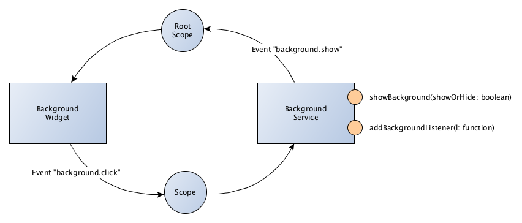

Temperature Sensor Monitor
==========================

> The application presents the sensor data.


Table of Content
----------------

* [Project Layout](#user-content-project-layout)
    * [Requirements](#user-content-requirements)
    * [Components](#user-content-components)
    * [Folder Layout](#user-content-folder-layout)
* [Concept](#user-content-concept)
    * [Background Widget](#user-content-background-widget)
* [License](#user-content-license)


Project Layout
--------------

The layout of the project is described in this chapter.

### Requirements

The following tools are use for developing and deployment.

* [NodeJS](https://nodejs.org/)
* [Gulp](http://gulpjs.com/)


### Components

The following components are using in the project

* [AngularJS](https://angularjs.org/)
* [Angular UI Router](https://github.com/angular-ui/ui-router)
* [Normalize CSS](https://github.com/necolas/normalize.css/)
* [Font Awesome](https://fortawesome.github.io/Font-Awesome/)
* [JQuery](https://jquery.com/)

```sh
$ bower install --save jquery
$ bower install --save bootstrap
$ bower install --save angular
$ bower install --save angular-animate
```


### Folder Layout

```
[projectRoot]
 + src
 |  + app
 |  |  + assets
 |  |  |  + css
 |  |  |  + images
 |  |  + index.html
 |  + modules
 |  + styles
 + gulp
 + bower.json
 + package.json
 + gulpfile.js
```

* All sources in the directory `src`.
* All static html in directory `src/app`.
* All static assets in the directory `src/app/assets`.
* All angular services, controllers etc (plus styles) in directory `src/modules`.
* All basic styles in directory `src/styles`.
* All Gulp sources in directory `gulp`.

### Setup Develop Environment

Some Gulp settings are private.

* First: create in your home directory the file `.temperature-sensor-monitor.json`.
* Second: insert the settings in this file

```json
{
  "proxyDomain": "http://example.com/temo"
}
```


Concept
-------


### Background Widget

The background widget is an overlay, that covers up the complete screen. This is for popup oder modal dialogs. If a user
is clicked on the background, then it send an event `background.click`.

In order for the background will be displayed or hidden, you can use the service `tsmBackgroundService`.
You can also register a listener for the click on the Background in this service.




License
-------

```
The MIT License (MIT)

Copyright (c) 2015 BlueSkyFish

Permission is hereby granted, free of charge, to any person obtaining a copy
of this software and associated documentation files (the "Software"), to deal
in the Software without restriction, including without limitation the rights
to use, copy, modify, merge, publish, distribute, sublicense, and/or sell
copies of the Software, and to permit persons to whom the Software is
furnished to do so, subject to the following conditions:

The above copyright notice and this permission notice shall be included in
all copies or substantial portions of the Software.

THE SOFTWARE IS PROVIDED "AS IS", WITHOUT WARRANTY OF ANY KIND, EXPRESS OR
IMPLIED, INCLUDING BUT NOT LIMITED TO THE WARRANTIES OF MERCHANTABILITY,
FITNESS FOR A PARTICULAR PURPOSE AND NONINFRINGEMENT. IN NO EVENT SHALL THE
AUTHORS OR COPYRIGHT HOLDERS BE LIABLE FOR ANY CLAIM, DAMAGES OR OTHER
LIABILITY, WHETHER IN AN ACTION OF CONTRACT, TORT OR OTHERWISE, ARISING FROM,
OUT OF OR IN CONNECTION WITH THE SOFTWARE OR THE USE OR OTHER DEALINGS IN
THE SOFTWARE.
```

